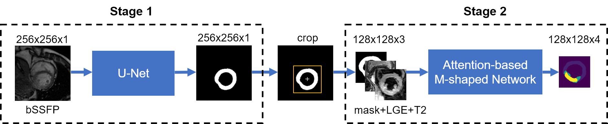

# MyoPS20-HNU

This is a solution of myocardial pathology segmentation combining multi-sequence CMR (MyoPS 2020), which is a challenge of MICCAI 2020.

The repository contains the core codes of "Two-stage Method for Segmentation of the Myocardial Scars and Edema on Multi-sequence Cardiac Magnetic Resonance".

If you have any questions, please contact phun@hnu.edu.cn.

## Overview
In this paper, we proposed a novel fully-automatic two-stage method to segment myocardial scars and edema in multi-sequence CMR. Our method mainly consists of two neural networks:
- A segmentation network for bFFSP images: A U-net is used to roughly locate and segment the entire myocardium. The mask of the myocardium obtained at this stage is applied as part of the input of the second stage to constrain the location of myocardial scars and edema.
- A segmentation network for multi-sequence images: An M-shaped network with the constraints of myocardial shape and the attention mechanism is applied to segment both myocardial scars and edema.

